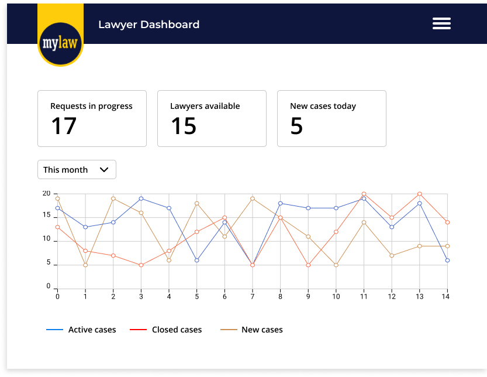

# Lawyer Dashboard

As a LegalTech company, we are always looking for ways to make life easier for our lawyers. To do this, we must ensure lawyers have access to relevant information at their fingertips to enable them to work efficiently.

A recent challenge we have faced in the company was lawyers not having a realtime high-level overview of what was being worked on at the moment. We get lots of requests daily and we need to have a view of our overall workload in order to know how best to allocate our resources.

For this challenge, you will be building a dashboard using HTML/CSS and Javascript, that will report the following information:

- Total number of requests
- Number of requests in progress
- Lawyers available
- Requests per lawyer
- New cases today

This dashboard is one of the pages in a bigger system being built to enable our lawyer better manage their workload.

Here's a prototype of the system:

A few requirements:

- We want to be able to display the data by month for the last 6 months (accessible via the dropdown above graph)
- You can use any charting library of choice
- While defining your data model, clearly differentiate how many data sources you will require to get the data needed to render your page. These data source will be equivalent to API calls/GraphQL queries. For now, we only need for this to be done using JS data structures but having in mind that this could be switched out for a backend.
- Feel free to augument the design while keeping the main components and functionality.

What we'll be looking out for:

- Semantic HTML code
- Clean design implementation
- Clean JS code
- Modelling of the data and use of Javascript data structures to manage information to be rendered
- Micro-interaction design

As a bonus:

- Create a close to functional backend using [json-server](https://github.com/typicode/json-server) and switch out the data sources in your code to use your fake endpoints.

Of course you don't have to do all of this but we expect that you make this as best as you possibly can.

You may use any Javascript technologies of your choosing (Vanilla Javscript, Vue, React, Angular etc.)
