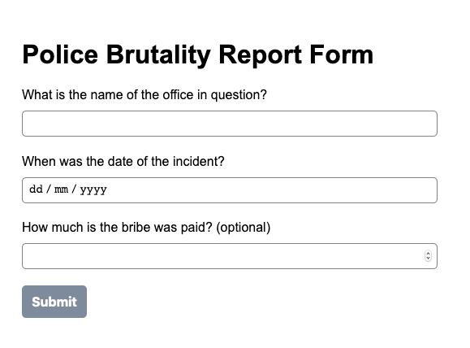

# JS Form Generator Component

At mylawlegal, we are constantly thinking of new ways to meet the needs of our customers by adjusting our product offerings accordingly. Depending on the service being offered, we may need to collect different types of information from the user to enable the lawyers properly assess the case and treat accordingly. As such, it is vital as a technology team to be able to do this in a fast an effective manner while reusing code as much as possible.

For this exercise, you will be creating an component that is able to generate a form from a JS data structure. For now, we only intend to collect **text input**, **long text input**, **numeric data** and **dates**.

As an example of how we may use this component is shown below:

```jsx
// NOTE: Though this illustration is created using React syntax, you are free to use any technology of your choice

import FormGenerator from './FormGenerator';

const form = [
  {
    label: 'What is the name of the officer in question?',
    type: 'text',
  },
  {
    label: 'When was the date of the incident?',
    type: 'date',
  },
  {
    label: 'How much is the bribe that was paid? (optional)',
    type: 'number',
  },
];

// We have omitted the header and buttons from the data structure. You may choose how this bit fit into the datastructure

const FormPage = () => {
  const handleSubmission = useCallback((formFields) => {
    // Logic to handle submission of form fields
  }, []);

  return <FormGenerator form={form} submit={handleSubmission} />;
};

export default FormPage;
```

This will render the following form:



**What we'll be looking out for:**

- Component architecture
- Clean code
- Data modelling
- Proper use of Javascript data structures

Feel free to modify the data structure provided as much as possible to suit your purposes as we will also be looking out for how you model your data overall.

_As a bonus:_

- You may add validation to the rendered form such that validation rules can be embedded in the JS object and your component can work based on these validation rules.
- Add a few more field types e.g.
  - Radio option (one choice from a set of radio buttons)
  - Select (one choice from a dropdown list of options),

You may make use of any Javascript Frameworks/Libraries of your choice - Vue.js, React or Angular.js.
